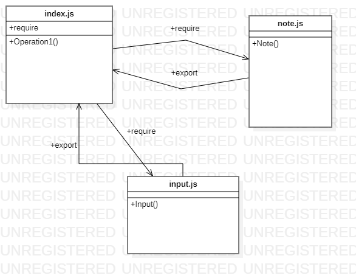

[LINK PULL Request](https://github.com/laith-401-advanced-javascript/notes/pull/1)
[LINK PULL Request](https://github.com/laith-401-advanced-javascript/notes/pull/2)
[LINK PULL Request](https://github.com/laith-401-advanced-javascript/notes/pull/3)


# lab / class-01

## Project:A terminal based (CLI) application

### About this repostory

---
A terminal based (CLI) application allowing users to easily create and manage a list of categorized notes

Time to get hands on with Node.js development! Today, you’ll begin a multi-day build of a command-line (Terminal-based) note taking application.

This begins the first of a 4-part build of an application called Notesy. Today, our goal will be to get the basic wiring of the application in place, ensuring that our notes app can receive user input (a note) and provide some basic output in response.
---
```

### Features

---
Number and name of feature: Notes
Estimate of time needed to complete: 3 hours 
Start time: 16:00
Finish time: 21:0
Actual time needed to complete: 5 hours
---


### Setup


#### How to initialize/run your application (where applicable)

-  `node index.js`
- `npm test `

#### How to use your library (where applicable)

#### Tests

- `npm test`

```
#### UML

Link to an image of the UML for your application and response to events




```
### date
Date published

---
date: 2020-9-7 10:00
---
```
### author

author: Laith Al Daree
---
```
### location

---
location: Az Zarqa-Al Azraq-Jordan
---
```

### Contact 
```
---
Email:mr.laith_2011@hotmail.com
GitHub:https://github.com/laith-2020
linkedIn :https://www.linkedin.com/in/laith-aldaree/
---
```


* if you have any quastion feel free to send me an 
  email : mr.laith_2011@hotmail.com


### Github Actions
[actions](https://github.com/laith-401-advanced-javascript/notes/actions/runs/243430952)