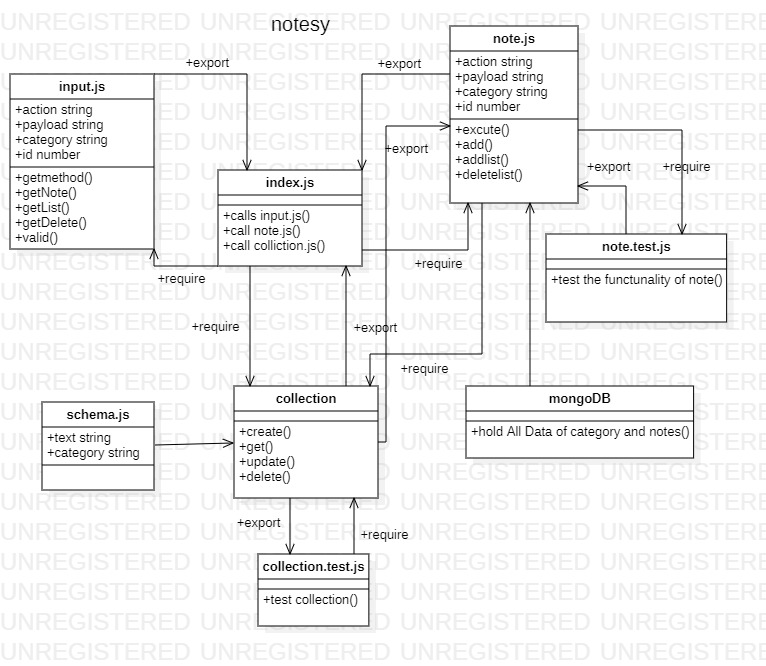

**labs**     | **URL**
------------ | -------------
Home         | [Home](https://github.com/laith-401-advanced-javascript/notes)
 class-01    | [class-01](https://github.com/laith-401-advanced-javascript/notes/pull/1)
 class-02    | [class-02](https://github.com/laith-401-advanced-javascript/notes/pull/2)
 class-03    | [class-03](https://github.com/laith-401-advanced-javascript/notes/pull/3)
 class-04    | [class-04](https://github.com/laith-401-advanced-javascript/notes/pull/4)


# labs


#### How to initialize/run your application (where applicable)

-  `node index.js`
- `npm test `

#### How to use your library (where applicable)

#### Tests

- `npm test`


### date
Date published

---
date: 2020-9-7 10:00
---

### author

author: Laith Al Daree
---

### location

---
location: Az Zarqa-Al Azraq-Jordan
---


### Contact 
```
---
Email:mr.laith_2011@hotmail.com
GitHub:https://github.com/laith-2020
linkedIn :https://www.linkedin.com/in/laith-aldaree/
---
```


* if you have any quastion feel free to send me an 
  email : mr.laith_2011@hotmail.com


### Github Actions
[actions](https://github.com/laith-401-advanced-javascript/notes/actions/runs/243430952)


#### UML



